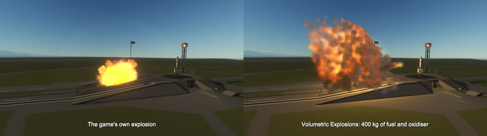
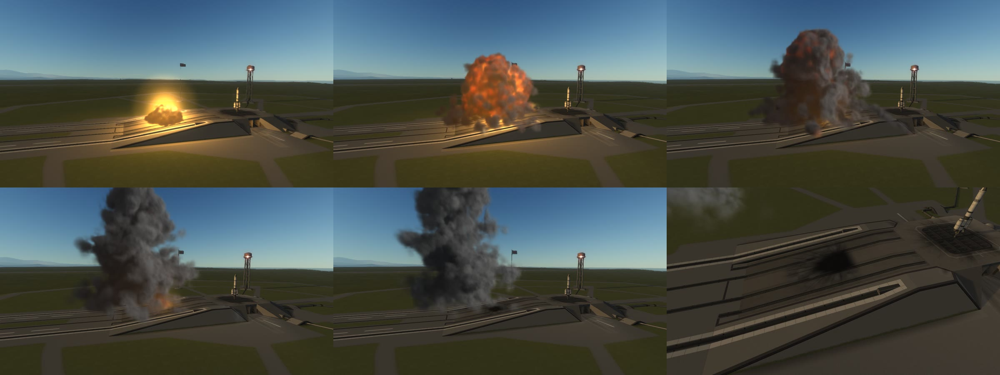
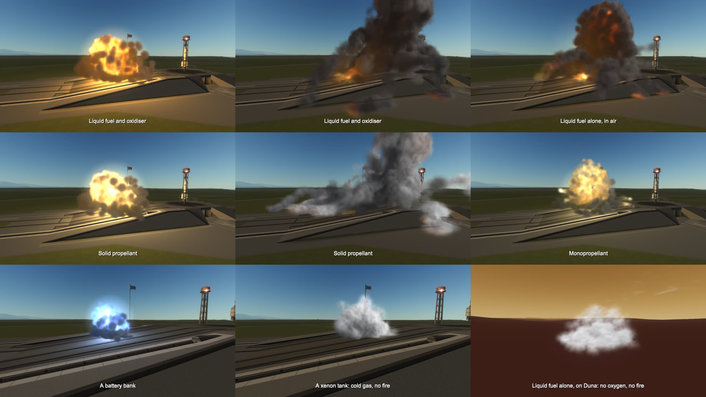

# Volumetric Explosions

A Kerbal Space Program 1 mod that replaces the game's flat explosion sprites with a small simulation of
fire, smoke and dust, drawn as a true volume.

Thousands of particles are carried by a model of the air, gathered into a 3D grid of smoke and heat, lit
by the sun, the sky and the fire, and drawn by a shader that walks a ray through that grid for every pixel:
the way Counter-Strike 2 draws its smoke grenades. There are no pictures of explosions in this mod. It
needs no other mod and changes nothing but the look.

*Left: the game's own explosion. Right: the same blast with the mod.*

## Install

Copy the `VolumetricExplosions` folder from the download into your KSP `GameData` folder and start the game. To remove it,
delete that folder. For KSP 1.12.x; it needs no other mod.

On a Mac, a copy downloaded with a browser runs slower until you allow its library with one command:
see [Installing](https://github.com/IshiakiZ/ksp-volumetric-explosions/wiki/Installing).

## What you get

* **What blew up decides the look.** Fuel and oxidiser give an orange fireball and thick dark smoke; solid
  propellant a white-hot flash and pale smoke; monopropellant a pale yellow fire; a battery a blue-white
  flash; xenon a cold white burst; ore, dust. The size comes from how much there was.
* **So do why and where.** A crash throws fire and dust on ahead; thin air lets a blast spread wide; in a
  vacuum there is no smoke; without oxygen, fuel alone does not burn; at night smoke is lit by its own fire.
* **Smoke that behaves like smoke.** It rises and rolls into a mushroom, drifts on a wind (when there is
  one), lies on the ground as the ground really is and runs downhill when it has cooled, goes round
  buildings and ships, and is pushed about by craft and their exhaust.
* **Shock fronts** that bend the picture as they pass, **pieces** of the destroyed parts, and **burn marks**
  thrown onto whatever surface is there.
* **Shadows and lamps** (0.5.0). Smoke throws its shadow on the ground, buildings and ships under it in
  sunlight, and at night is lit by the lamps round about as well as by its own fire.
* **Wakes and depth** (0.5.0). What flies through smoke leaves a ragged tunnel that churns and fills in behind
  it, a plane's wing tips roll the smoke up and its downwash carries it down; smoke in front always hides smoke
  behind, whichever patch of air each is in; a fireball turns to smoke from the outside in, and burning wreckage
  sends up plumes.
* **Its air takes more than explosions** (since 0.4.0). Another mod can feed it the smoke and the flames of
  rocket engines: see [engines' smoke and flames](https://github.com/IshiakiZ/ksp-volumetric-explosions/wiki/Engines-smoke-and-flames).
  By itself the mod does nothing with engines.

*Each panel is a blast of its own. The battery and the xenon tank are seen from closer: they are small.*

## Settings

In `GameData/VolumetricExplosions/PluginData/settings.cfg`. The ones most worth knowing: `quality` (0.2 light to 3
heavy), `size`, `smoke` (how long it hangs), `wind`, and `enabled = false` to have the stock explosions
back. [All of them](https://github.com/IshiakiZ/ksp-volumetric-explosions/wiki/Settings).

## Where it works

| System | |
| --- | --- |
| Mac | Made and tested here (KSP 1.12.5, OpenGL). |
| Linux | The game runs on OpenGL there too, so it should work the same. **Never run.** |
| Windows | Tried on Windows 11 (KSP 1.12.5 on its own Direct3D 11): the smoke is drawn as a volume there too, by the same shaders compiled for Direct3D (`PluginData/shaders-windows.bundle`). A rocket crashed by the pad drew its fire and smoke as a volume, the right way up, burn marks on the ground and the shock front's bending; two fires side by side drew their smoke mingled, with no seam; engines' flames and smoke (Engine Flames, Rocket Smoke) drew into it; the mod's library made the grids the same as the C# to the last place, both the one built on Windows (`vfxgrid.dll`, Microsoft's compiler) and the one a Mac makes with Zig; at night the fire lit what stood round it and the pad's floodlights lit the smoke. 165 frames a second without smoke, 141 with a 4-tonne fuel fire in view (an NVIDIA GeForce RTX 4080 SUPER at 1280 x 720). Started with `-force-glcore` (OpenGL) the volume is drawn too. Then the smoke's own shadow on the ground (there with shadows on, gone with them off), and other worlds: the Mun (no smoke: a ball of fire flying apart, the dust ringing out and dropping back, a burn mark), Duna (a wide, thin cloud with red dust; fuel alone only a cold white cloud), Eve (a tight fireball, a column of smoke and a fire burning on), Laythe, and in orbit (a ball of fire that swells and thins away in seconds). |

What it costs: on an Apple M5 Pro at 1280 x 720, a 4-tonne fuel fire filling half the view took the game
from 79 frames a second to 56 in its first seconds and 70 to 75 once it was smoke.

## More

* [What decides how an explosion looks](https://github.com/IshiakiZ/ksp-volumetric-explosions/wiki/What-decides-how-an-explosion-looks)
* [What the smoke does](https://github.com/IshiakiZ/ksp-volumetric-explosions/wiki/What-the-smoke-does)
* [Shock fronts, debris and burn marks](https://github.com/IshiakiZ/ksp-volumetric-explosions/wiki/Shock-fronts-debris-and-burn-marks)
* [How it is drawn, and where](https://github.com/IshiakiZ/ksp-volumetric-explosions/wiki/How-it-is-drawn)
* [What it costs](https://github.com/IshiakiZ/ksp-volumetric-explosions/wiki/What-it-costs) and
  [what was tested](https://github.com/IshiakiZ/ksp-volumetric-explosions/wiki/What-was-tested)
* [Limits](https://github.com/IshiakiZ/ksp-volumetric-explosions/wiki/Limits)
* [Building it yourself](https://github.com/IshiakiZ/ksp-volumetric-explosions/wiki/Building)

`./build.sh` builds the mod and installs it; it needs the .NET SDK and a copy of the game.

## Licence

[MIT](LICENSE).
