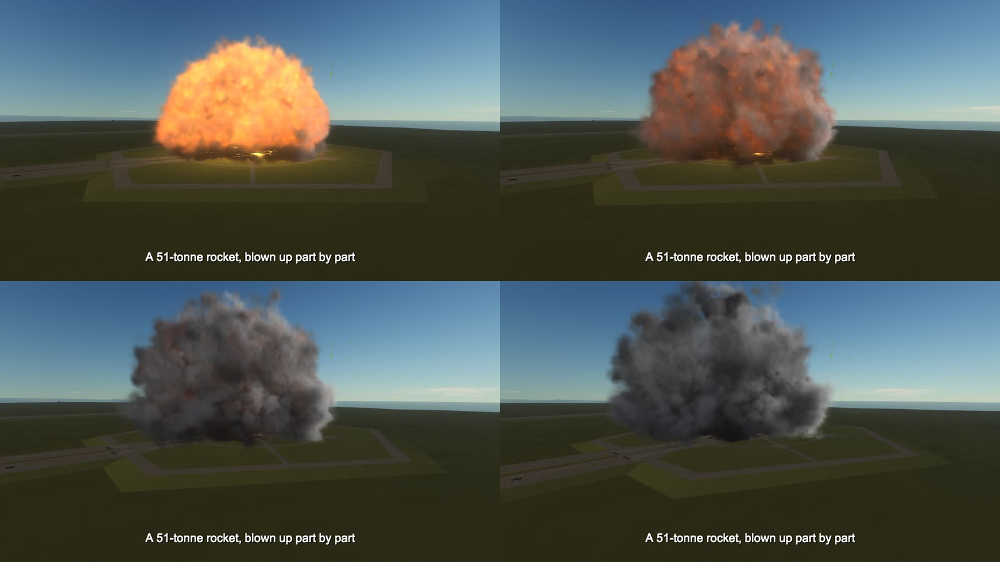

# Settings

`GameData/VolumetricExplosions/settings.cfg`:

| Setting | Default | Meaning |
| --- | --- | --- |
| `enabled` | `true` | `false` brings the stock explosions back |
| `quality` | `1.0` | number of particles, and how finely the smoke is stepped through: 0.2 (light) to 3 (heavy) |
| `max_particles` | `30000` | most particles alive in the scene at once |
| `size` | `1.0` | how big explosions are, 0.3 to 3 |
| `smoke` | `1.0` | how long smoke hangs in the air, 0 (none) to 4 |
| `wind` | `1.0` | strength of the made-up wind when there is one (about two times in three), 0 (always still air) to 4 |
| `detail` | `0.6` | how deeply the billows are cut into the edge of the smoke, 0 (smooth) to 1 |
| `thick` | `1.6` | how thick the smoke is, 0.3 (thin) to 4 |
| `volume` | `true` | `false` draws soft sprites even where the volume would work |
| `half` | `true` | draw the volume with half as many pixels each way and enlarge it; `false` draws it at the screen's full size |
| `thin` | `2.0` | smoke too thin to see is not drawn: how many 255ths of what is behind it a line of sight's smoke may hide, at the very most, before any of it is drawn. 0 (all of it is drawn) to 8 |
| `light` | `true` | explosions light the ground and the wreck around them |
| `debris` | `true` | pieces of the destroyed parts |
| `shockwave` | `true` | the shock front of a blast, in air |
| `bend` | `1.0` | how strongly a shock front bends the picture and jolts the camera, 0 to 2 |
| `shake` | `true` | `false`: a shock front reaching the camera leaves the camera alone |
| `sound_travels` | `true` | the bang is heard when its sound gets to the camera (a second for every 340 metres at sea level on Kerbin), as the shock front does. `false`: on the instant, as the game has it |
| `scorch` | `true` | burn marks |
| `push` | `true` | ships and engine exhaust push smoke about |
| `collide` | `true` | smoke does not pass through the ground, buildings or ships |
| `threads` | `0` | worker threads to use, for moving the particles and (without the library) for making the grid; 0 picks by itself |
| `native` | `true` | make the grids with the mod's library where there is one; `false` always uses the slower C# (the picture is the same) |
| `log` | `false` | write how each explosion was read (what, why, where) to `KSP.log` |

Changes take effect at the next flight.

