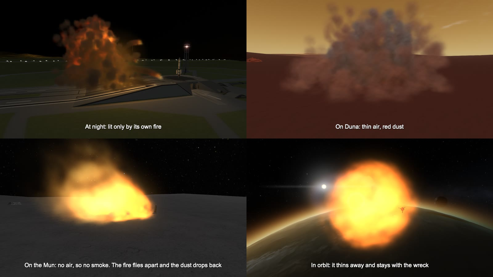

# What decides how an explosion looks

**What blew up.** The mod notes what was in each part in the moment before the game destroys it.

| In the part | What you get |
| --- | --- |
| Liquid fuel and oxidiser | An orange fireball that rolls up into thick dark smoke, burning pieces thrown out on trails, and a fire left burning on the ground |
| Liquid fuel alone | In air with oxygen: a slower, redder, sootier fire. With no oxygen (Duna, Eve, a vacuum): no fire at all, only a cold white cloud |
| Solid propellant | A white-hot flash, pale grey smoke, burning chunks on white trails |
| Monopropellant | A pale yellow fire and little smoke |
| Xenon and other gases | A cold white burst and no fire |
| Batteries, with nothing that burns | A blue-white electrical flash and sparks |
| Ore | Dust |
| Nothing | Sparks and dust; a small bang if the game counts the part as explosive |

*Each panel is a blast of its own, set off alone in a scene with no other smoke in it. The battery and the xenon tank are seen from closer: they are small.*

The size comes from the amount of propellant, not from a fixed list: the radius of the fireball grows
with roughly the cube root of the kilograms that burn (4 tonnes gives about 19 m).

**Why it blew up.** A crash throws the fire and the dust on ahead in the direction of travel and leaves
a burn mark drawn out the same way; so does a ship that blows up in flight, whose fire flies on along its
path, light and all, until the air has stopped it. A part that overheats burns up brightly with little smoke and many
sparks. Parts torn off by over-stress or pressure come apart quietly.

**Where it is.** Air density sets how far the blast spreads before the air stops it, how the smoke
rises and how long it hangs. Thin air (Duna, or high up) lets a blast spread nearly twice as far, and
what it throws out spreads as much wider and thinner on the way: a wide, see-through cloud. In a vacuum there is no smoke: the fire flies outward, thins and is gone,
and dust flies in clean arcs and drops back. With no oxygen in the air, fuel without its own oxidiser
does not burn. Dust takes the colour of the ground of that body and biome. At night the smoke is lit
only by its own fire. On water there is spray and mist, and under water no fire.

