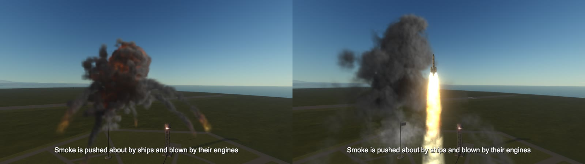

# What the smoke does

* It rises as a bubble of hot gas that rolls over itself (which is what makes a mushroom), draws a stem
  up after it, slows, and then drifts.
* A fire left on the ground breathes. With each breath a bubble of hot gas goes up from it, turning over
  as it climbs and drawing the air in behind it; one after another these carry the smoke up as a column,
  roll it into billows on the way, and pull nearby smoke in towards the fire.
* It leans and drifts on a wind, when there is one. The game has none, so one is made up for each place
  and half hour: from a light air to a fresh breeze, held back near the ground and stronger with height
  (which leans a column over more the higher it gets), coming in gusts that travel downwind, and swinging
  from side to side. About one time in three the air is still instead, and smoke goes straight up and
  hangs where it is. It moves the smoke only, never your craft.
* It is stirred by eddies of three sizes, which are carried along by that wind as real ones are, so smoke
  drifting with the wind is wound up by the eddy it is in. It spreads by mixing with the air around it and
  thins as it spreads, so it lingers for a minute or so and fades by getting thinner.
* A later blast shoves aside the smoke of an earlier one.
* **Ships push it about.** A craft moving through smoke parts it and drags it along in its wake, and a
  running engine blows it away down the line of its exhaust.
* **It does not pass through solid things.** The ground, buildings and the parts of ships turn it aside.
* **It lies on the ground as the ground really is.** The mod sounds the ground under every cloud (a few
  thousand of the game's own collision queries, on its worker threads, again whenever the cloud outgrows
  or drifts off what has been sounded) and keeps its height on a lattice. None of the smoke is under the
  ground: a puff that would reach below it is stood on it, flatter and wider, and each part of it stands
  on the ground under that part, so the foot of a cloud follows a slope down, dips into a hollow and hangs
  over an edge like a blanket instead of ending flat in the air. A blast on a slope throws its fire and
  dust out over the ground as it lies, up the slope and down it. The air near the ground goes along it, up
  a rise and down a fall. And smoke that has cooled, dust and cold vapour, being heavier than air, run
  slowly downhill where they lie on a slope (about a metre a second on a slope of one in three), while
  what is still hot goes up as before. Over water the sea is the ground.
* It is thick. The body of a cloud is solid to look at, and nothing shows through it: where less than a
  fiftieth of the light behind would get through, none does. Billows are cut only into its surface, so it
  ends in rounded bulges with creases between them and not in a blur.
* **The billows belong to the smoke.** Every particle carries with it the place whose billows it shows,
  so a billow rises with the smoke it is made of, turns in the eddies that carry it and is drawn out as
  the smoke spreads, instead of the smoke sliding through a pattern that stands still in the air. Billows
  are replaced by fresh ones as eddies in real smoke come and go, small ones twice as often as big ones.
  There are always three sets of each size on the go, a third of a lifetime apart, each counting for
  nothing when it is new, for most in the middle of its life and for nothing again at its end: so the
  shape of a cloud changes at one even rate. (With two sets, as it was until 2026-10-07, a cloud held its
  shape for most of a second, changed in a rush, and held again.)
* **How fast its billows change depends on what the smoke is doing.** A set of billows is kept for as long
  as the air where the smoke is takes to pull it out of shape by about one and a half times its own size,
  and no longer: half a second or a second in what a blast flings out and a fire sends up, ten or twenty
  seconds in a cloud drifting on the wind, twenty to forty in smoke left hanging in still air, which
  hardly changes at all. (Until the evening of 2026-10-07 all the smoke of an explosion changed its big
  billows every 2.8 seconds and its small ones every 1.4, whatever it was doing: smoke that had come to
  rest went on churning as fast as the fire, and for some seconds after a blast the billows of the fastest
  smoke were drawn out into streaks. What the change is worth, and what it costs, is under [What was tested](What-was-tested.md).)
* A puff that strays off on its own is not a soft ball: where there is little smoke round about, the
  billows cut right through it and leave a ragged scrap.
* It is shaded as a volume: the side away from the sun is dark, the underside darker, each billow has a
  lit side and a shaded one, thin smoke in front of the sun shines, and firelight shows on it from inside.
* It is hidden by whatever stands in front of it, and stops at whatever it meets.
* Between one grid and the next (a grid takes a few frames to make) the shader carries the smoke on at
  the speed each part of it was moving, so it moves every frame and not in steps. Where a whole cloud is
  flying along (the fire of a ship that blew up at speed), its box goes along with it meanwhile.

